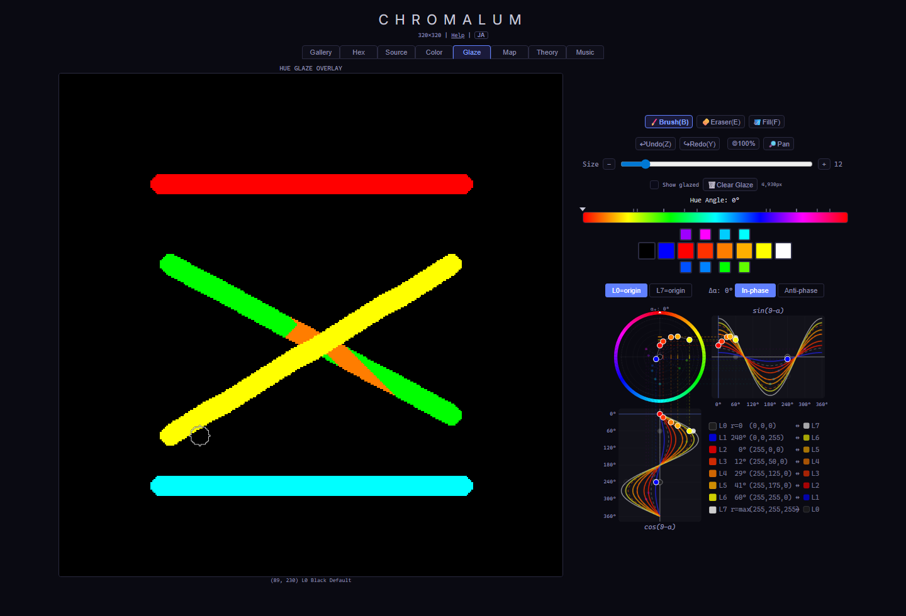
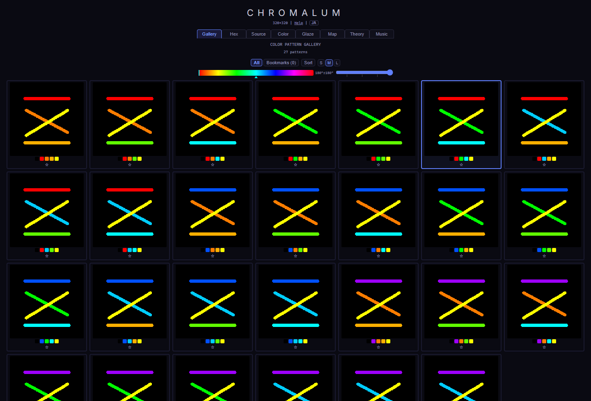
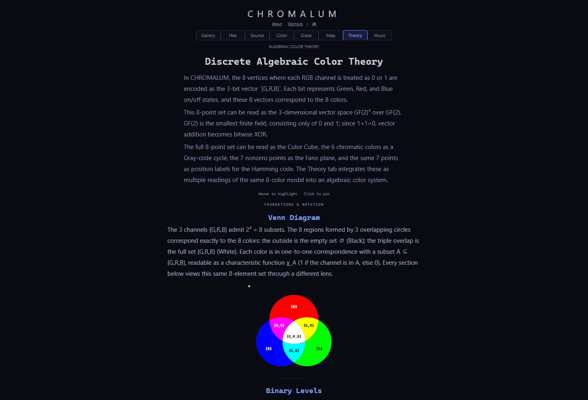
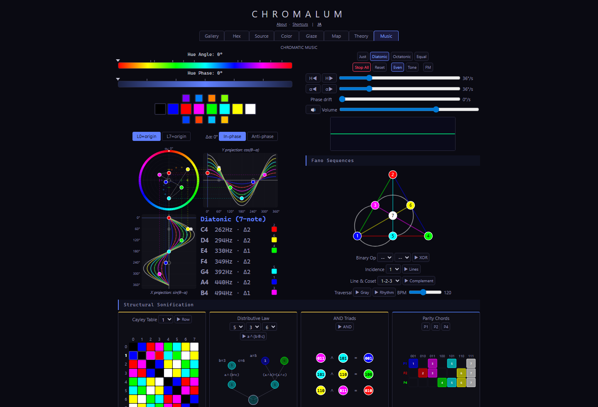

# CHROMALUM

[](https://github.com/minoreality/chromalum/actions/workflows/deploy.yml)
[](https://github.com/minoreality/chromalum/actions/workflows/ci.yml)
[](https://github.com/minoreality/chromalum/actions/workflows/codeql.yml)
[](./LICENSE)
[](./docs/LICENSE.md)

CHROMALUM is a browser-based React/Vite app for pixel art and algebraic color theory,
built around an eight-level luma model based on BT.601. It combines canvas drawing,
color remapping, glaze variants, gallery and map/statistics views, plus Theory and
Music tabs that explore the same eight-level structure through `GF(2)^3`, RGB cube
geometry, the Fano plane, Hamming codes, and related polyhedral structures.

**Demo:** [minoreality.github.io/chromalum](https://minoreality.github.io/chromalum/)

## Screenshots

| Glaze tab                                                 | Gallery tab                                                   |
| --------------------------------------------------------- | ------------------------------------------------------------- |
|  |  |

| Theory tab                                                  | Music tab                                                 |
| ----------------------------------------------------------- | --------------------------------------------------------- |
|  |  |

## Features

- Pixel-art drawing with brush, eraser, fill, line, rectangle, ellipse, undo,
  redo, pan, zoom, image import, PNG export, and mobile touch support.
- Eight-level luma source model mapped into chromatic color variants.
- Glaze layer for per-pixel color-variant overrides without changing the
  source luma structure.
- Gallery generation for color-pattern variants, bookmarks, previews, and
  PNG exports.
- Map/statistics views for composition, tone, color tone, connected regions,
  gradients, edge depth, isolation, and local diversity.
- Theory tab explaining the color system through binary levels, XOR, cube
  geometry, the Fano plane, Hamming codes, tetrahedra, octahedra, and compound
  polyhedra.
- Music tab connecting the same algebraic structures to chords, parity,
  Hamming decoding, rhythmic grids, and sonification.
- English/Japanese UI text with persistent language selection.

## Design Intent

CHROMALUM keeps one compact data model at the center: every source pixel stores
one of eight luma levels, while color mapping and optional glaze overrides select
chromatic variants for those levels. This lets the app treat drawing, gallery
generation, analysis, mathematical diagrams, and sonification as different views
of the same discrete color structure instead of separate feature islands.

The implementation favors browser-native primitives and explicit data
structures over heavy runtime dependencies. Canvas buffers use typed arrays,
large pixel operations can run in Web Workers with synchronous fallbacks,
undo/redo stores compact diffs, and autosave uses IndexedDB.

## Technical Highlights

- **Canvas rendering:** direct pixel-buffer rendering with dirty-rect updates.
- **Performance:** typed arrays, reusable buffers, scanline flood fill, and
  worker-backed flood fill and pixel analysis.
- **Undo/redo:** compressed diffs with optional color-map deltas.
- **Persistence:** debounced IndexedDB autosave with pagehide/visibility flush.
- **Offline support:** production builds include a service worker that
  pre-caches the app shell, icons, workers, and lazy-loaded Music tab chunk for
  offline reopening.
- **Testing:** Vitest unit tests plus Playwright end-to-end, accessibility, PWA,
  and local visual-regression checks covering canvas pixels, save flows, gallery
  previews, glaze clearing, Theory rendering, offline behavior, mobile touch
  input, and stable layouts.
- **Quality gates:** TypeScript strict mode, ESLint, Prettier, coverage
  thresholds, CodeQL, Dependabot, pinned GitHub Actions, and GitHub Pages
  deployment.

## Offline and Local Data

CHROMALUM can be reopened offline after the production app has loaded once and
the service worker has cached the app shell. The current work state is autosaved
in this browser on this device using IndexedDB; where supported, the app makes a
best-effort request for persistent browser storage after a successful autosave.

Browser storage is not a backup: clearing site data, using private browsing, or
switching devices can remove local work. Save PNG exports for images you need to
keep outside the browser.

## Architecture

For the detailed technical architecture, see
[docs/architecture.md](./docs/architecture.md).

```text
src/
  components/  React panels, controls, diagrams, and visualizations
  components/music/
               Music-tab controls, diagrams, and sonification widgets
  components/theory/
               Theory-tab diagrams and interaction helpers
  hooks/       UI state, canvas interaction, workers, export, pan/zoom, audio
  music/       Audio graph helpers, playback runners, schedules, and sequences
  drawing/     Paint primitives, flood fill, dirty rects, render buffers
  state/       Canvas reducer, color reducer, contexts, undo diff logic
  workers/     Flood fill and pixel-analysis worker entry points
  utils/       IndexedDB persistence, pixel analysis, ring buffer, errors
  data/        Theory, hex, and music data sets
  i18n/        English/Japanese translations
  styles/      Shared CSS and design tokens
  assets/      Static app assets used by the React UI
e2e/           Playwright browser flows
docs/          Research docs, architecture notes, licenses, and screenshots
```

## Development

This project uses Node.js and npm. The expected toolchain is pinned through
Volta:

```text
node 24.14.1
npm 11.9.0
```

Install dependencies:

```bash
npm install
```

Start the local development server:

```bash
npm run dev
```

Create a production build:

```bash
npm run build
```

Create an itch.io-style relative-path build:

```bash
npm run build:itch
```

Run type checks:

```bash
npm run typecheck:app
npm run typecheck:tooling
npm run typecheck:all
```

Run unit tests:

```bash
npm test
```

Run coverage:

```bash
npm run test:coverage
```

Run local performance benchmarks:

```bash
npm run benchmark
```

Run end-to-end tests:

```bash
npm run test:e2e
```

Run local visual regression checks:

```bash
npm run test:visual
```

Update visual baselines after an intentional UI change:

```bash
npm run test:visual:update
```

Visual regression is currently a manual/local check, not a required CI gate.

Run linting and formatting checks:

```bash
npm run lint
npm run format:check
```

Run the standard local verification set:

```bash
npm run verify
```

Run broader browser/PWA or full coverage verification:

```bash
npm run verify:e2e
npm run verify:full
```

To inspect canvas performance locally, open the app with `?debugPerf` appended
to the URL. The console reports rolling `avgMs`, `p95Ms`, and `maxMs` for
`renderBuf`, analysis map rendering, flood fill requests, and pixel-analysis
requests.

`format:check` covers source, tests, GitHub configuration, root Markdown, and
technical Markdown in `docs/`, plus TypeScript and tooling config files.
Long-form research notes keep their editorial line wrapping and are excluded in
`.prettierignore`.

## Documentation

See [docs/README.md](./docs/README.md) for the documentation map and the
recommended reading order for research notes.

The core corpus is the three-part _Tractatus Chromaticus_ ("Chromatic
Treatise"), a unified treatise on the discrete algebraic color model that
underlies the application:

- Pars I - [離散代数的色彩モデル](./docs/algebraic-color-model.md)
- Pars II - [離散代数的色彩モデル — 先行研究](./docs/prior-art-algebraic-color-model.md)
- Pars III - [Theoryタブ — 先行研究と改善提案](./docs/theory-tab-prior-art-and-improvements.md)

Two Music Appendix notes extend the same model into LinkedVisualization and
sonification:

- Appendix A - [Music-Linked Visualization](./docs/music-linked-visualization.md)
- Appendix B - [Music-Linked Visualization — 先行研究と設計ノート](./docs/prior-art-music-linked-visualization.md)

The research documents are credited to the pseudonymous author **Doctor Chromaticus**.

## Security

Please report security issues privately. See
[SECURITY.md](./SECURITY.md) for supported versions, report scope, and the
vulnerability reporting process.

## License

- **Application source code, tests, build config, and non-scholarly app assets:**
  [MIT License](./LICENSE)
- **Scholarly/explanatory content:**
  [Creative Commons Attribution 4.0 International (CC BY 4.0)](./docs/LICENSE.md)

The CC BY 4.0 content includes the research and explanatory documents in
`docs/`, including the _Tractatus Chromaticus_ core corpus and the Music
Appendix notes, plus the authored prose, labels, and rendered explanatory
diagrams in the Theory tab. The code that implements those views remains
MIT-licensed.

Technical project documentation, including
[docs/architecture.md](./docs/architecture.md), follows the MIT-licensed
project documentation unless a document says otherwise.

When reusing material from the CC BY 4.0 content, see the
[citation templates](./docs/LICENSE.md#how-to-cite) for academic, blog, book,
slide, translation, and short-form attribution formats.
