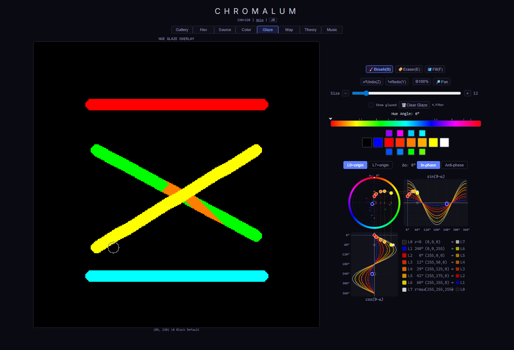
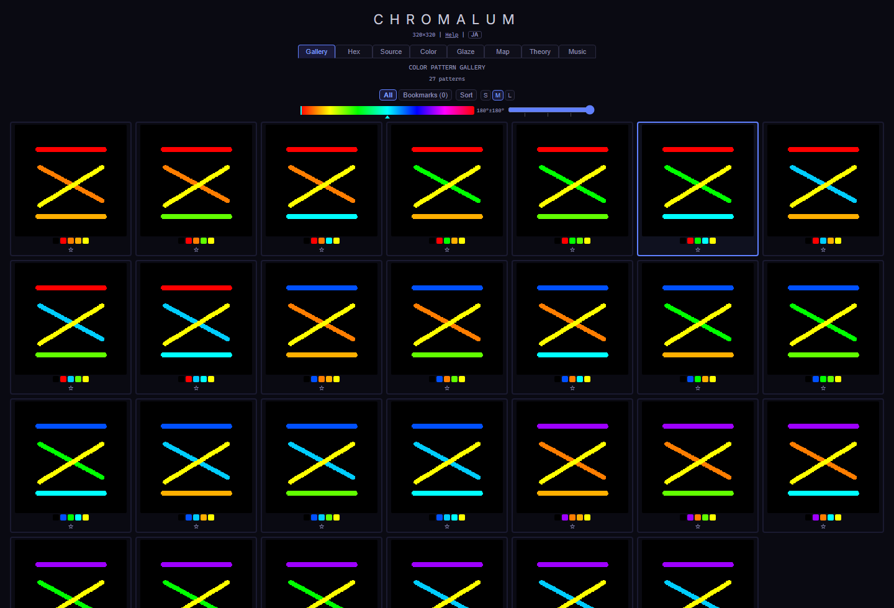
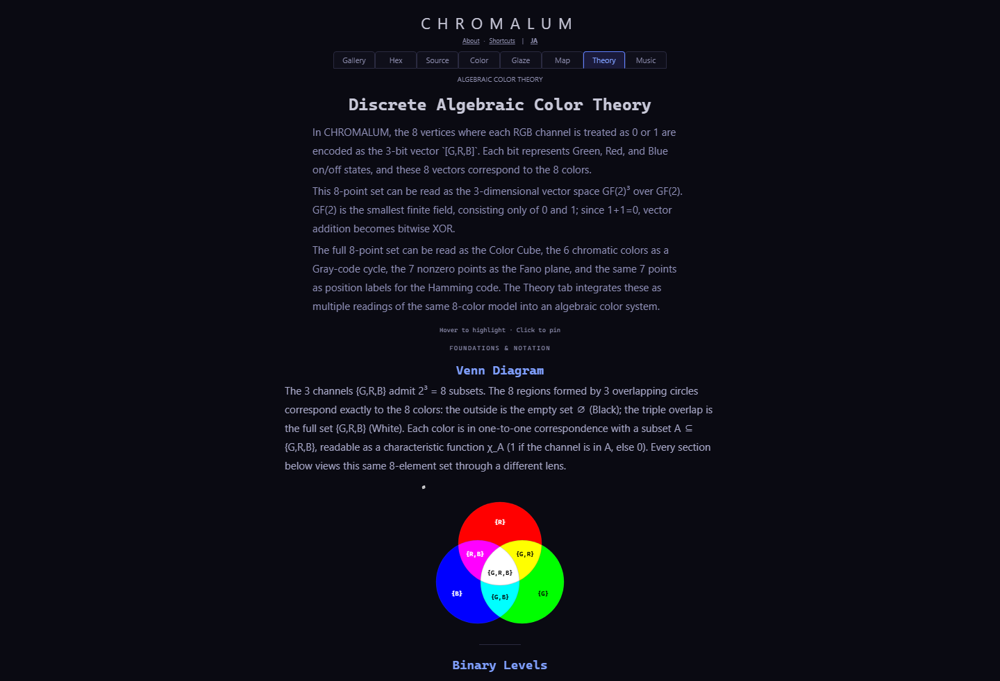
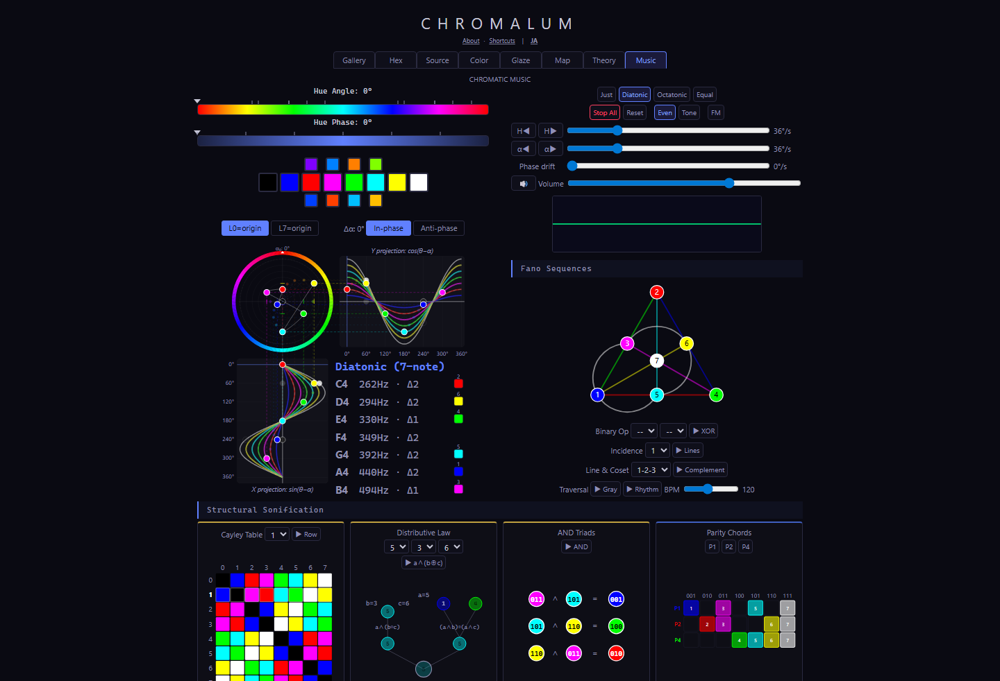

# CHROMALUM

[](https://github.com/minoreality/chromalum/actions/workflows/deploy.yml)
[](https://github.com/minoreality/chromalum/actions/workflows/ci.yml)
[](https://github.com/minoreality/chromalum/actions/workflows/codeql.yml)
[](./LICENSE)
[](./docs/LICENSE.md)

CHROMALUM is a browser-based React/Vite app for pixel art and algebraic color theory,
built around an eight-level GRB Binary Tone model. It combines canvas drawing,
color remapping, glaze variants, gallery and Map analysis views, plus Theory and
Music tabs that explore the same 4:2:1 GRB level structure through `GF(2)^3`,
RGB cube geometry, the Fano plane, Hamming codes, and related polyhedral
structures.

**Demo:** [minoreality.github.io/chromalum](https://minoreality.github.io/chromalum/)

## Screenshots

| Glaze tab                                                 | Gallery tab                                                   |
| --------------------------------------------------------- | ------------------------------------------------------------- |
|  |  |

| Theory tab                                                  | Music tab                                                 |
| ----------------------------------------------------------- | --------------------------------------------------------- |
|  |  |

## Features

- Pixel-art drawing with brush, eraser, fill, line, rectangle, ellipse, undo,
  redo, pan, zoom, image import, PNG export, and mobile touch support.
- Eight-level GRB Binary Tone source model mapped into chromatic color variants.
- Glaze layer for per-pixel color-variant overrides without changing the
  source tone structure.
- Gallery generation for color-pattern variants, bookmarks, previews, and
  PNG exports.
- Map analysis views for composition, model tone, connected regions, gradients,
  boundary distance, isolation, and local diversity.
- Theory tab explaining the color system through binary levels, XOR, cube
  geometry, the Fano plane, Hamming codes, tetrahedra, octahedra, and compound
  polyhedra.
- Music tab connecting the same algebraic structures to chords, parity,
  Hamming decoding, rhythmic grids, and sonification.
- English/Japanese UI text with persistent language selection.

## Design Intent

CHROMALUM keeps one compact data model at the center: every source pixel stores
one of eight tone levels, while color mapping and optional glaze overrides select
chromatic variants for those levels. This lets the app treat drawing, gallery
generation, analysis, mathematical diagrams, and sonification as different views
of the same discrete color structure instead of separate feature islands.

The algebraic layer and palette layer are related but distinct. XOR, Fano,
Hamming, and K8 operate on the eight binary level labels. Chromatic variants are
representatives from the RGB cube's maximum-saturation hue loop (the pure-hue
loop, defined by maximum channel 1 and minimum channel 0) that project to those
labels by equal GRB tone; their continuous coordinates are not themselves
`GF(2)^3` vectors.

The implementation favors browser-native primitives and explicit data
structures over heavy runtime dependencies. Canvas buffers use typed arrays,
large pixel operations can run in Web Workers with synchronous fallbacks,
undo/redo stores compact diffs, and autosave uses IndexedDB.

## Technical Highlights

- **Canonical pixel state:** a reducer owns L0–L7 source levels in a
  `Uint8Array` and a separate per-pixel Glaze override buffer. Palette changes
  update lookup tables without rewriting source levels.
- **Incremental Canvas rendering:** drawing coalesces dirty rectangles per
  animation frame and renders through cached `ImageData` and packed color
  lookup tables, while reusable stroke buffers limit allocation during pointer
  interaction.
- **Worker-backed computation:** larger scanline flood fills and selected Map
  computations use Web Workers with transferable buffers and synchronous fallback
  paths. Request IDs, canvas generations and reducer validation reject stale
  results before they can replace current pixels or analysis views.
- **Cached derived views:** Gallery enumerates palette choices for present,
  unlocked levels and caches thumbnails generated in cancellable chunks. Map
  caches results by source/override buffer identity and analysis mode, then
  preloads remaining modes after the active one.
- **Transactional undo/redo:** bounded ring buffers store pixel diffs with
  run-length-encoded indices. A single reducer transition applies or reverses
  source and Glaze changes together, updating the level histogram from the
  same diff.
- **Persistence under concurrency:** debounced IndexedDB autosave uses
  revision-based compare-and-swap within one transaction to reject stale-tab
  overwrites. Restore guards preserve edits made during loading, and versioned
  validation normalizes legacy records; invalid or unsupported records, read
  failures, and revision conflicts stop autosave with a persistent status.
  Explicit recovery archives unreadable data and saves current work atomically.
- **Shared color algebra:** the model constructs the chromatic six-cycle from
  the binary RGB cube and combines it with GRB rank weights to compute hue
  fibers and palette candidates for rendering, Theory and Music. Lossy sRGB
  import classification stays separate from exact model coordinates and their
  display projection.
- **Web Audio sonification:** pure algebraic playback sequences are separated
  from audio graph and session management. The graph maps hue to pitch and
  stereo position, complement phase to gain, and binary channel bits to
  spectral components, connecting visual structure to sound.
- **Browser-only offline runtime:** rendering, analysis, persistence and audio
  run in the browser without a backend. A build-generated service worker uses
  content-versioned caches for the app shell, workers and lazy Theory/Music
  chunks, enabling offline reopening after initial caching.
- **Invariant and browser verification:** Vitest checks fill/diff properties
  and independently reconstructs mathematical invariants; Playwright checks
  canvas pixels, persistence races, accessibility and production offline
  behavior. CI enforces coverage thresholds, strict typing, lint, formatting
  and dead-code checks, alongside CodeQL scanning and Dependabot updates.

## Offline and Local Data

CHROMALUM can be reopened offline after the production app has loaded once and
the service worker has cached the app shell. The current work state is autosaved
in this browser on this device using IndexedDB; where supported, the app makes a
best-effort request for persistent browser storage after a successful autosave.

Browser storage is not a backup: clearing site data, using private browsing, or
switching devices can remove local work. Save PNG exports for images you need to
keep outside the browser.

## Architecture

For the detailed technical architecture, see
[docs/architecture.md](./docs/architecture.md).

```text
src/
  components/  React panels, controls, diagrams, and visualizations
  components/music/
               Music-tab controls, diagrams, and sonification widgets
  components/theory/
               Theory-tab diagrams and interaction helpers
  hooks/       UI state, canvas interaction, workers, export, pan/zoom, audio
  music/       Audio graph helpers, playback runners, schedules, and sequences
  drawing/     Paint primitives, flood fill, dirty rects, render buffers
  state/       Canvas reducer, color reducer, contexts, undo diff logic
  workers/     Flood fill and pixel-analysis worker entry points
  utils/       IndexedDB persistence, pixel analysis, ring buffer, errors
  data/        Theory, hex, and music data sets
  i18n/        English/Japanese translations
  styles/      Shared CSS and design tokens
  assets/      Static app assets used by the React UI
e2e/           Playwright browser flows
docs/          Research docs, architecture notes, licenses, and screenshots
```

## Development

This project uses Node.js and npm. The expected toolchain is pinned through
Volta:

```text
node 24.14.1
npm 11.19.1
```

Install dependencies:

```bash
npm install
```

Install or refresh the Playwright Chromium browser after first setup or after
`@playwright/test` updates:

```bash
npm run playwright:install
```

Start the local development server:

```bash
npm run dev
```

Start the development server on the fixed local address used for manual checks:

```bash
npm run dev:local
```

For Theory research and editing, start the dedicated development entry:

```bash
npm run dev:theory
```

This displays all Theory sections without initializing the editor, drawing,
Gallery, or PWA modules.

Create a production build:

```bash
npm run build
```

Create an itch.io-style relative-path build:

```bash
npm run build:itch
```

Run type checks:

```bash
npm run typecheck:app
npm run typecheck:tooling
npm run typecheck:all
```

Run unit tests:

```bash
npm test
```

Run the focused Theory copy guard test:

```bash
npm run test:theory-copy
```

Run coverage:

```bash
npm run test:coverage
```

Run dead-code detection:

```bash
npm run deadcode
```

Run local performance benchmarks:

```bash
npm run benchmark
```

Run end-to-end tests:

```bash
npm run test:e2e
```

Run linting and formatting checks:

```bash
npm run lint
npm run format:check
```

Run the focused type and test checks for Theory work:

```bash
npm run verify:theory
```

Run the standard local verification set before pushing:

```bash
npm run verify
```

Run the same verification command used by the pre-push hook:

```bash
npm run verify:prepush
```

Run broader browser/PWA or full coverage verification:

```bash
npm run verify:e2e
npm run verify:full
```

To inspect canvas performance locally, open the app with `?debugPerf` appended
to the URL. The console reports rolling `avgMs`, `p95Ms`, and `maxMs` for
`renderCanvasBuffers`, analysis map rendering, flood fill requests, and
pixel-analysis requests.

`format:check` covers source, tests, GitHub configuration, root Markdown, and
technical Markdown in `docs/`, plus TypeScript and tooling config files.
Long-form research notes keep their editorial line wrapping and are excluded in
`.prettierignore`.

## Documentation

For first-time app usage, see [docs/user-guide.md](./docs/user-guide.md). For
the full documentation map and the recommended reading order for research
notes, see [docs/README.md](./docs/README.md). For contribution workflow and
local verification expectations, see [CONTRIBUTING.md](./CONTRIBUTING.md).

The core corpus is the three-part _Tractatus Chromaticus_ ("Chromatic
Treatise"), a unified treatise on the discrete algebraic color model that
underlies the application:

- Pars I - [離散代数的色彩モデル](./docs/algebraic-color-model.md)
- Pars II - [離散代数的色彩モデル — 先行研究](./docs/prior-art-algebraic-color-model.md)
- Pars III - [Theoryタブ — 先行研究と改善提案](./docs/theory-tab-prior-art-and-improvements.md)

Two Music Appendix notes extend the same model into LinkedVisualization and
sonification:

- Appendix A - [Music-Linked Visualization](./docs/music-linked-visualization.md)
- Appendix B - [Music-Linked Visualization — 先行研究と設計ノート](./docs/prior-art-music-linked-visualization.md)

The research documents are credited to the pseudonymous author **Doctor Chromaticus**.

## Security

Please report security issues privately. See
[SECURITY.md](./SECURITY.md) for supported versions, report scope, and the
vulnerability reporting process.

## License

- **Application source code, tests, build config, and non-scholarly app assets:**
  [MIT License](./LICENSE), except the third-party asset noted below
- **Scholarly/explanatory content:**
  [Creative Commons Attribution 4.0 International (CC BY 4.0)](./docs/LICENSE.md)

The CC BY 4.0 content includes the research and explanatory documents in
`docs/`, including the _Tractatus Chromaticus_ core corpus and the Music
Appendix notes, plus the authored prose, labels, and rendered explanatory
diagrams in the Theory tab. The code that implements those views remains
MIT-licensed.

Technical project documentation, including
[docs/user-guide.md](./docs/user-guide.md) and
[docs/architecture.md](./docs/architecture.md), follows the MIT-licensed
project documentation unless a document says otherwise.

When reusing material from the CC BY 4.0 content, see the
[citation templates](./docs/LICENSE.md#how-to-cite) for academic, blog, book,
slide, translation, and short-form attribution formats.

### Third-Party Assets

`public/og-image.png`, the social preview image, is **not** covered by the MIT
License. It was drawn for this project by another artist, who retains
copyright in it, and is included here with permission for use as CHROMALUM's
social card. It is not offered for redistribution, modification, or resale
under the MIT terms that cover the rest of this repository. A fork that needs
its own social card should replace this file.
