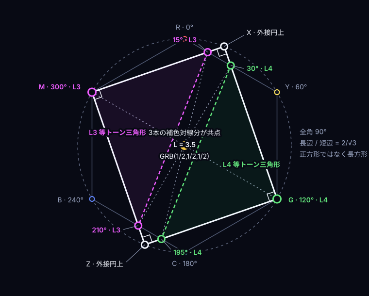
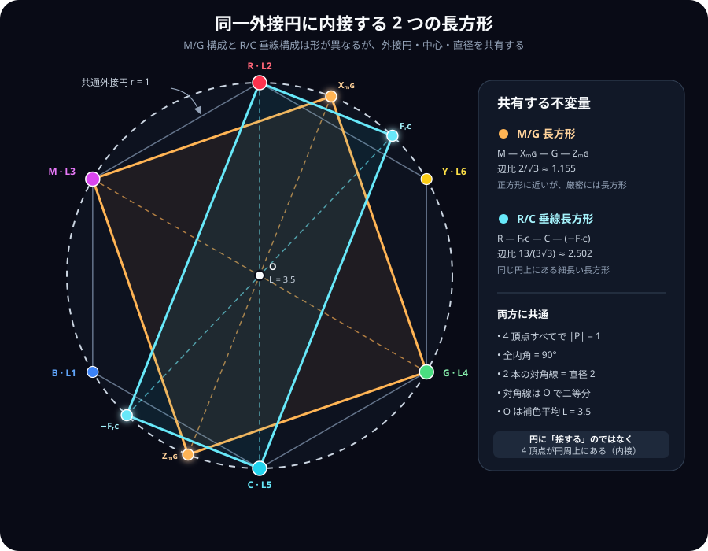

# 離散代数的色彩モデル

## Related Notes

- 先行研究・新規性評価: [離散代数的色彩モデル — 先行研究](./prior-art-algebraic-color-model.md)
- Theoryタブの改善提案: [Theoryタブ — 先行研究と改善提案](./theory-tab-prior-art-and-improvements.md)
- Music-Linked Visualization: [Music-Linked Visualization](./music-linked-visualization.md)

## Abstract

本ノートは、CHROMALUM の Theory タブで用いている 8 色モデルを、離散代数・有限幾何・符号理論・多面体幾何の観点から整理する。モデルの核は、RGB チャンネルのオン/オフを 3 ビットベクトルとして読み、8 つの色を GF(2)^3 の元に対応させることである。

この核そのものは既知である。RGB 色立方体、Z2 x Z2 x Z2 による色加算、Fano 平面 PG(2,2)、Hamming(7,4) 符号との関係は、既存の数学教材・レクリエーショナル数学・色空間解説に現れる。

本モデルの独自性は、これら既知構造を、`level = 4G + 2R + B` による GRB Binary Tone 順序、補色トーン定理、標準サイコロの対面和 7、色相グレイ巡回、Fano/Hamming 対応、多面体双対、K8 の Hamming 距離分解として、単一の 8 色体系へ統合する点にある。

## Model Assumptions

本モデルは一般的な色彩科学全体を扱うものではない。以下の仮定に基づく、有限個の色を対象とする離散モデルである。

1. 色集合は RGB チャンネルのオン/オフだけからなる 8 色である。
2. 各色はビット列 `[G,R,B]` で表す。
3. レベル番号は `lv = 4G + 2R + B` で定義する。
4. 加法的な構造は GF(2)^3 上の XOR で読む。
5. 集合論的な構造は `{G,R,B}` の部分集合束 B3 として読む。
6. 補色は `c' = c xor 7` で定義する。
7. トーン指標には、GRB Binary Tone

   ```text
   T = (4G + 2R + B) / 7
   ```

   を用いる。

このトーンは CIE の知覚明度でも、WCAG の相対輝度でもない。外部の輝度規格を導入せず、3 ビットの GRB 番号そのものを `0..1` に正規化した離散指標である。したがって本モデルの「トーン順」は、知覚的均等性やアクセシビリティ・コントラストを直接保証しない。

## Color Labels

本モデルでは、8 色を次のようにラベル付けする。

| lv | bits `[G,R,B]` | set | color | short | tone |
| ---: | :---: | :--- | :--- | :---: | ---: |
| 0 | 000 | empty | Black | K | 0/7 |
| 1 | 001 | {B} | Blue | B | 1/7 |
| 2 | 010 | {R} | Red | R | 2/7 |
| 3 | 011 | {R,B} | Magenta | M | 3/7 |
| 4 | 100 | {G} | Green | G | 4/7 |
| 5 | 101 | {G,B} | Cyan | C | 5/7 |
| 6 | 110 | {G,R} | Yellow | Y | 6/7 |
| 7 | 111 | {G,R,B} | White | W | 7/7 |

ここで tone は `level / 7` である。Canvas/PNG/画像入力では、この正準 tone を表示・入出力用の RGB バイト値へ写像するが、モデル上のトーンは常に `0/7..7/7` として扱う。

## Known Structures

### RGB Color Cube

RGB 色空間を 3 次元立方体として見ることは標準的である。8 頂点は `000` から `111` までの 3 ビットベクトルであり、各辺は 1 チャンネルの切り替えに対応する。

CHROMALUM ではこの立方体を Q3 として扱い、辺を Hamming 距離 1 のペアとして読む。

### Boolean Lattice B3

8 色は `{G,R,B}` の全ての部分集合と同一視できる。

```text
K = empty
B = {B}
R = {R}
G = {G}
M = {R,B}
C = {G,B}
Y = {G,R}
W = {G,R,B}
```

この見方では、OR は集合和、AND は集合共通部分、補色は `{G,R,B}` における集合補集合である。

### GF(2)^3 / Z2 x Z2 x Z2

XOR は GF(2)^3 の加法である。各色は基底 `{B=1, R=2, G=4}` の一意な XOR 結合として表せる。

```text
B xor R = M
B xor G = C
R xor G = Y
B xor R xor G = W
c xor c = K
c xor (c xor 7) = W
```

この種の色加算モデルは既知であり、既存文献では 8 色を `Z2 x Z2 x Z2` の元として扱う例がある。本ノートでは、これを CHROMALUM のトーンレベル、Fano/Hamming、多面体構造へ接続する。

### Hue Hexagon / Gray Cycle

完全飽和色の有彩色 6 頂点は、RGB 色立方体の黒白軸を囲む六角形として現れる。

```text
R -> Y -> G -> C -> B -> M -> R
```

CHROMALUM のレベル順で書くと、

```text
2 -> 6 -> 4 -> 5 -> 1 -> 3 -> 2
```

であり、各ステップは 1 ビットだけを反転する。したがってこれは、立方体 Q3 の有彩色頂点上の 6-cycle であり、Gray code 的な巡回である。

### Pure-Color Tone Intersections

上の色相六角形は、純色条件

```text
max(R,G,B) = 1, min(R,G,B) = 0
```

を満たす RGB cube の境界閉路でもある。各辺では、RGB 成分のうち 1 成分だけが `0` から `1`、または `1` から `0` へ線形に変化し、他の 2 成分は `0` または `1` に固定される。

CHROMALUM の内部計算では、この閉路をデバイスRGBのバイト値ではなく、`0..4` の正確な整数座標 `GRB(G4,R4,B4)` で表す。GRB順は Binary Tone の重み `4:2:1` と座標成分を一致させ、15度刻みの交点を整数として保持する正準内部表現である。

```text
R  = GRB(0,4,0)   Y = GRB(4,4,0)   G = GRB(4,0,0)
C  = GRB(4,0,4)   B = GRB(0,0,4)   M = GRB(0,4,4)

15deg = GRB(1,4,0)
30deg = GRB(2,4,0)
45deg = GRB(3,4,0)
```

この座標での正確なレベル式は

```text
L = (4G4 + 2R4 + B4) / 4
T = L / 7
```

である。8-bit sRGB、Canvas、PNGはこのモデルの公理ではなく、最終的な表示・入出力アダプターとしてのみ扱う。デバイス値から色相角やレベルを逆算して正準座標を変更しない。

#### GRB Decomposition and Four Angle Variables

正規化した CHROMALUM 座標を

```text
c = GRB(g,r,b),  0 <= g,r,b <= 1
L(c) = 4g + 2r + b
```

とする。正六角形の外接半径を `1`、Red を画面上方向、Green を右下、Blue を左下へ置く 2 次元写像を

```text
H(c) = (x,y)
x = (sqrt(3)/2)(g-b)
y = (g+b)/2-r
```

と定義すると、`R -> (0,-1)`, `G -> (sqrt(3)/2,1/2)`, `B -> (-sqrt(3)/2,1/2)` になる。この写像は中立方向を消去し、

```text
H(c + t*GRB(1,1,1)) = H(c)
H(GRB(1,1,1)-c) = -H(c)
```

を満たす。したがって 2 次元位置だけでは level は一意に決まらない。一方、`H(c)=(x,y)` と `L` を同時に指定すれば、

```text
g = (L + 2y +  4x/sqrt(3)) / 7
r = (L - 5y -  3x/sqrt(3)) / 7
b = (L + 2y - 10x/sqrt(3)) / 7
```

として GRB を一意に復元できる。ゆえに

```text
GRB 3D coordinate  <->  (2D hue vector H, GRB level L)
```

は完全な座標分解である。同じ 2 次元位置へ level `L1`, `L2` を割り当てた 2 つの lift は、正規化座標で

```text
c_L2 - c_L1 = ((L2-L1)/7) GRB(1,1,1)
```

だけ異なる。この中立 lift の自由度が、六角形外の M/G 交点へ L3 または L4 の形式座標を与えられる一方、その 2 次元点自体には level が固有でない理由である。

2 次元半径には

```text
|H(c)|^2
  = g^2+r^2+b^2-gr-rb-bg
  = ((g-r)^2 + (r-b)^2 + (b-g)^2) / 2
```

が成り立つ。これは中立成分ではなく 3 チャンネル間の差だけを測る二次形式である。

このモデルでは、次の 4 種類の角度を区別する。

| symbol | meaning |
| --- | --- |
| `h` | 色相六角形の辺を線形補間する正準 hue parameter |
| `phi` | `H(c)` を原点から見た実際のユークリッド偏角 |
| `beta = h + alpha` | Music 単位円へ写した実効位相角 |
| `vartheta` | M/G と R/C の作図から生じる創発的な中心角 |

R-Y 辺で `t = h/60deg = 3h/pi` とすると、

```text
H(t) = (sqrt(3)t/2, -1+t/2)
rho(t)^2 = |H(t)|^2 = 1-t+t^2
phi(t) = atan2(sqrt(3)t, 2-t)
```

である。したがって、正準 hue parameter と実偏角は一般には一致しない。

| hue parameter `h` | actual polar angle `phi` | `rho^2` |
| ---: | ---: | ---: |
| `15deg` | `atan(sqrt(3)/7) ~= 13.8979deg` | `13/16` |
| `30deg` | `30deg` | `3/4` |
| `45deg` | `atan(3sqrt(3)/5) ~= 46.1021deg` | `13/16` |

これは矛盾ではない。`h` は GRB の線形補間、整数 level 交点、`15deg` 格子を保存し、`phi` は正六角形埋め込み後の実方向を表す。Music 単位円は `H(c)/|H(c)|` ではなく、正準パラメータを位相として使う `U(beta)=(sin(beta),-cos(beta))` であるため、さらに別の写像である。

画面複素座標 `z=x+iy` と `zeta=exp(2pi i/3)` を使えば、同じ 2 次元写像は

```text
z = -i (r + g*zeta + b*zeta^2)
```

と書ける。`1+zeta+zeta^2=0` が中立方向の消去を、`z -> -z` が補色半回転を表す。この複素表示は、後述する `Q(sqrt(-3))` のノルム構造と六角形の Fourier 選択則の基礎になる。

GRB Binary Tone

```text
T = (4G + 2R + B) / 7
```

は RGB 成分の線形関数なので、色相六角形の各辺上では tone も単調な一次関数として変化する。したがって、隣接する 2 頂点のレベル差が `d` のとき、その辺は端点を含めて `d + 1` 個の離散 tone レベルを横切る。

色相閉路

```text
2 -> 6 -> 4 -> 5 -> 1 -> 3 -> 2
```

を各純色辺ごとの通過レベルとして展開すると、端点を含めて次のようになる。

```text
R -> Y : 2 3 4 5 6
Y -> G : 6 5 4
G -> C : 4 5
C -> B : 5 4 3 2 1
B -> M : 1 2 3
M -> R : 3 2
```

この色相閉路について、閉路の始点 `2` を最後に重複させない形で通過レベルを列挙すると、

```text
2,3,4,5,6,5,4,5,4,3,2,1,2,3
```

となる。対応する hue parameter の角度を度数法とラジアンで書くと次の表になる。

```text
0°     R  = 2  -> 0
15°       = 3  -> π/12
30°       = 4  -> π/6
45°       = 5  -> π/4
60°    Y  = 6  -> π/3
90°       = 5  -> π/2
120°   G  = 4  -> 2π/3
180°   C  = 5  -> π
195°      = 4  -> 13π/12
210°      = 3  -> 7π/6
225°      = 2  -> 5π/4
240°   B  = 1  -> 4π/3
270°      = 2  -> 3π/2
300°   M  = 3  -> 5π/3
```

このラジアン表記は角度単位の換算であり、Tone Zigzag を正弦波や余弦波として定義するものではない。ここでの tone は、色相六角形の各辺上で GRB Binary Tone が作る区分線形関数である。

この区分線形関数を `L(h) = 7T(h)` と書くと、三角関数的な座標系に対して次の構造を持つ。ここで `h` は上で区別した正準 hue parameter であり、六角形点の実偏角 `phi` ではない。

第一に、すべての交点角は `π/12` の格子上にある。各純色辺の角幅は `60° = π/3` であり、各辺の level 変化量は

```text
+4, -2, +1, -4, +2, -1
```

である。したがって、最大変化量 4 の辺では level 交点の最小角度刻みが

```text
(π/3) / 4 = π/12
```

になる。4:2:1 正規化で候補角が 15 度刻みにそろうのは、この `π/12` 格子の帰結である。

第二に、補色半回転に対して

```text
L(h + π) = 7 - L(h)
T(h + π) = 1 - T(h)
```

が成り立つ。中心化した波形

```text
F(h) = L(h) - 7/2
```

で見ると、

```text
F(h + π) = -F(h)
```

であり、周期関数としては half-wave antisymmetry を持つ。ただし、これは Tone Zigzag を正弦波にするという意味ではなく、補色反転が三角関数的な半周期反転と同じ形で書けるという意味である。

#### Complement Half-Turn and Equitone Chord Symmetry

純色色相六角形上の点を、正準整数座標

```text
c(h) = GRB(G4,R4,B4),  0 <= G4,R4,B4 <= 4
```

で表す。純色境界では `max(G4,R4,B4) = 4` かつ `min(G4,R4,B4) = 0` である。補色写像

```text
kappa(c) = GRB(4-G4, 4-R4, 4-B4)
```

は、この六角形を中心

```text
m = GRB(2,2,2)
```

のまわりに 180 度回転する中心反転であり、色相角では

```text
kappa(c(h)) = c(h + 180deg)
```

に対応する。整数座標上の level を

```text
L(c) = (4G4 + 2R4 + B4) / 4
```

とすると、六角形上の頂点と辺上のすべての点について

```text
L(kappa(c)) = 7 - L(c)
L(h) + L(h + 180deg) = 7
```

が成り立つ。頂点では

```text
R(L2) <-> C(L5)
Y(L6) <-> B(L1)
G(L4) <-> M(L3)
```

であり、15 度刻みの交点でも、たとえば

```text
15deg(L3) <-> 195deg(L4)
30deg(L4) <-> 210deg(L3)
45deg(L5) <-> 225deg(L2)
90deg(L5) <-> 270deg(L2)
```

となる。このため、同一 level の異なる色相点を直線で結んで作る等トーン図形には、次の中心対称な対応が現れる。

```text
L2: {0deg, 225deg, 270deg}   --180deg rotation--> L5: {180deg, 45deg, 90deg}
L3: {15deg, 210deg, 300deg}  --180deg rotation--> L4: {195deg, 30deg, 120deg}
L1: {240deg}                 --180deg rotation--> L6: {60deg}
```

したがって、`L2` と `L5` の 3 点を結ぶ三角形は互いに 180 度回転像であり、`L3` と `L4` の三角形も同じ関係にある。これらの三角形は一般には正三角形ではない。ここで現れるのは、重みなし六角形の全二面体対称性そのものではなく、GRB の `4:2:1` level ラベルを伴う

```text
half-turn + level reversal (L -> 7-L)
```

という中心補色対称性である。

任意の補色対の座標和と中点は

```text
c + kappa(c) = GRB(4,4,4)
(c + kappa(c)) / 2 = GRB(2,2,2) = m
```

で一定になり、その中点 level は

```text
L(m) = (4*2 + 2*2 + 2) / 4 = 7/2 = 3.5
```

となる。画面用の正規化割合では、同じ中点は `GRB(1/2,1/2,1/2)` である。中心化座標

```text
v(c) = c - m
```

を使えば

```text
v(kappa(c)) = -v(c)
v(c) + v(kappa(c)) = 0
```

となるため、「補色同士が打ち消し合う」という記述は、中心化した CHROMALUM ベクトルについて厳密な意味を持つ。一方、中心化していないチャンネル座標の和は `GRB(4,4,4)`、平均は `GRB(2,2,2)` である。この区別により、ベクトル相殺、加法的な白、平均としての中心灰色を同じ補色対称性の異なる表現として整理できる。

##### Equitone Triangle Metric and Area

正準候補から作る等トーン三角形には、補色対称性により `L2` と `L5`、`L3` と `L4` の合同対ができる。正六角形の外接半径を `1` とした辺長二乗と面積は、

| triangle pair | squared side lengths | area |
| --- | --- | ---: |
| `L2 / L5` | `{7,28,49}/16` | `7sqrt(3)/32` |
| `L3 / L4` | `{21,28,49}/16` | `7sqrt(3)/16` |

である。`L3/L4` では

```text
21 + 28 = 49
```

となるため、M と G を直角頂点とする厳密な不等辺直角三角形になる。`L2/L5` では `7+28 != 49` なので直角ではない。また、

```text
Area(L3) = Area(L4) = 2 Area(L2) = 2 Area(L5)
```

が成り立つ。直角性は正六角形へ入れたユークリッド計量に依存するが、すべての図形へ同じアフィン変換を施したときの面積比 `2` は保存される。

2 次元外積 `a cross b = a_x b_y - a_y b_x` を使えば、原点と 2 点 `p,q` が作る三角形の面積は

```text
Area(O,p,q) = abs(p cross q) / 2
```

である。補色変換で両ベクトルを同時に反転しても `(-p) cross (-q) = p cross q` なので、相補三角形の向き付き面積と絶対面積は保存される。

##### L3/L4 Equitone-Ray Rectangle

`L3` の Magenta 頂点から他の `L3` 候補 `15deg`, `210deg` へ引く 2 直線と、`L4` の Green 頂点から他の `L4` 候補 `30deg`, `195deg` へ引く 2 直線を延長する。この 4 直線が作る図形を、Hex タブと同じ正六角形埋め込みで検証する。

六角形の中心を原点、外接円半径を `1`、画面下向きを y 軸の正方向とすると、必要な点は

```text
M    = (-sqrt(3)/2, -1/2)       G    = ( sqrt(3)/2,  1/2)
P15  = ( sqrt(3)/8, -7/8)       P30  = ( sqrt(3)/4, -3/4)
P210 = (-sqrt(3)/4,  3/4)       P195 = (-sqrt(3)/8,  7/8)
```

となる。4 直線を

```text
a = line(M, P15)      b = line(M, P210)
c = line(G, P30)      d = line(G, P195)
```

とすると、180 度中心対称性から

```text
a || d
b || c
```

である。また、M で交わる 2 直線の傾きは

```text
slope(a) = -sqrt(3)/5
slope(b) =  5/sqrt(3)
slope(a) * slope(b) = -1
```

なので直交する。外側の交点を

```text
X = a intersect c = ( 3*sqrt(3)/14, -13/14)
Z = b intersect d = (-3*sqrt(3)/14,  13/14) = -X
```

とすれば、四角形 `M-X-G-Z` の全内角は厳密に `90deg` であり、これは長方形である。

ただし隣接辺長は

```text
|MX| = |GZ| = sqrt(12/7)
|XG| = |ZM| = 4/sqrt(7)
long / short = 2/sqrt(3) ~= 1.1547
```

で等しくないため、正方形ではない。一方、外側 2 頂点について

```text
|X|^2 = (3*sqrt(3)/14)^2 + (13/14)^2 = 1
|Z|^2 = 1
```

となるため、`M`, `X`, `G`, `Z` の 4 頂点はすべて元の六角形と同じ外接円上にある。X 方向の六角形境界は原点から `(7/8)X` の位置にあるので、X と Z は外接半径の `1/8` だけ六角形の外へ出る。

ここには一般定理がある。同じ中心円上の 2 点を `p,q` とし、反対点を `-p,-q` とすると、四角形 `p-q-(-p)-(-q)` の隣接辺には

```text
(q-p) dot (-p-q) = |p|^2 - |q|^2 = 0
```

が成り立つ。したがって、同半径の 2 組の反対点から作る中心対称四角形は常に長方形である。半径 `1` なら辺長二乗は

```text
a^2 = 2 - 2 p dot q
b^2 = 2 + 2 p dot q
a^2 + b^2 = 4 = 2^2
```

となり、直径 `2` に対する三平方の定理が自動的に成立する。面積は

```text
Area = 2 abs(p cross q)
```

である。したがって M/G 構成に固有なのは「単位円上の反対点から長方形ができる」こと自体ではなく、等トーン線の外側交点 `X,Z` が厳密に元の単位円へ戻ること、さらに M/G の等トーン V 字自体が直交することである。

M/G 長方形の面積は

```text
Area_MG = sqrt(12/7) * 4/sqrt(7) = 8sqrt(3)/7
Area_MG / 2 = 4sqrt(3)/7 ~= 0.989743
```

である。単位円内接長方形の最大面積は正方形の `2` なので、M/G 長方形は最大面積の約 `98.97%` に達する。

対角点には

```text
M + G = 0
X + Z = 0
```

が成り立ち、長方形の 2 対角線 `MG`, `XZ` はともに長さ `2` の外接円直径として原点で交わる。さらに、色点を結ぶ 3 本の補色対線分

```text
M-G
P15-P195
P210-P30
```

もすべて同じ原点で交わる。各直径の色座標端点は `L3` と `L4` の補色対なので、その中点は共通して

```text
GRB(2,2,2),  L = 3.5
```

である。したがって、正六角形の中心、外接円の中心、長方形の対角線交点、3 本の補色対線分の共点、補色対の平均 `L=3.5` が同一点に一致する。なお、X と Z は 2 次元作図上の交点であって色相六角形上の色点ではないため、X と Z 自体には CHROMALUM level を割り当てない。

ここでの `L=3.5` は CHROMALUM の GRB Binary Tone level であり、測色学的な輝度、知覚的明るさ、光や顔料を物理的に混合した結果が常に一定になるという主張ではない。この中心対称性は、あくまで CHROMALUM の離散・区分線形モデル内部で成り立つ定理である。



上図では、`L3` と `L4` の等トーン三角形、同一外接円に内接する長方形、3 本の補色対線分が共点となる `GRB(2,2,2)` / `L=3.5` の中心を重ねている。図中の割合表示 `GRB(1/2,1/2,1/2)` は同じ中心の正規化表現である。

##### Complement-Line System and Metric Resonances

正準色相閉路上の 14 交点は、180 度回転 `kappa` によって次の 7 本の補色対線分へ分割される。

```text
R-P180(C)        P15-P195        P30-P210        P45-P225
Y-P240(B)        P90-P270        G-P300(M)
```

各線分の GRB 端点を `c`, `kappa(c)` とすると、すべてについて

```text
c + kappa(c) = GRB(4,4,4)
(c + kappa(c)) / 2 = GRB(2,2,2)
L(c) + L(kappa(c)) = 7
L((c + kappa(c)) / 2) = 3.5
```

が成り立つ。したがって、7 本はユークリッド長が同じ線分という意味ではないが、すべて同じ六角形中心を通り、同じ `L3.5` 平均を持つ。この「7」は、14 個の有彩交点が補色反転で 2 点ずつ対になること、および GRB Binary Tone の全重みが `4+2+1=7` であることの双方に対応する。ただし、ここでの 7 本の補色対線分と Fano 平面の 7 本の直線は定義の異なる対象であり、両者の一致を主張するには別の対応定理が必要である。

正六角形の隣接単位頂点を `A,B`、辺上の点を `P(t)=(1-t)A+tB` とすれば、`A dot B=1/2` なので

```text
|P(t)|^2 = 1-t+t^2 = 3/4 + (t-1/2)^2
```

が成り立つ。正準 14 点の半径は `1`, `sqrt(13)/4`, `sqrt(3)/2` の 3 層だけであり、7 本の補色対線分の長さは

| complement segments | length |
| --- | ---: |
| `R-C`, `Y-B`, `G-M` | `2` |
| `P15-P195`, `P45-P225` | `sqrt(13)/2` |
| `P30-P210`, `P90-P270` | `sqrt(3)` |

となる。全 14 点には

```text
sum p_i = 0
sum L_i = 49,  average L_i = 3.5
sum |p_i|^2 = 49/4,  average |p_i|^2 = 7/8
```

が成り立つ。最後の二次モーメント `49/4` と平均 `7/8` は、補色対称性だけで決まる普遍量ではなく、正六角形埋め込みと今回の 14 点選択に依存する派生規則である。

同様に、同一 level 上の 2 点 `c1`, `c2` を結ぶ等トーン線と、その補色像を結ぶ線には

```text
kappa(c2) - kappa(c1) = -(c2 - c1)
```

が成り立つ。このため、今回観察した相補的な等トーン線の組を含め、任意の等トーン弦とその補色弦は互いに平行かつ等長である。これは角度や円を使わない中心反転の結果であり、正六角形をアフィン変形しても保存される。

一方、直角、`60deg`、円内接、円周上の等間隔は、正六角形へ導入したユークリッド計量を使う追加構造である。中心反転だけからは導かれないため、次の性質は補色平行性より強い「計量的共鳴」として区別する。

1. これまでに検証した正準 14 点の等トーン線作図では、M/G 組に厳密な直角と外接円内接長方形が同時に現れる。
2. 別の L2/L4 組合せでは、正三角形ではない三角形の 1 角として厳密な `60deg` が現れる。
3. M/G 長方形と R/C 垂線長方形を同じ外接円上で比較すると、一方の外側頂点が他方の頂点と R/C 頂点の円弧中点になる。

ここで 1 の「M/G 組だけ」という一意性は、正準 14 候補と今回の有限な等トーン線作図規則に範囲を限定した主張である。任意の連続座標や任意の補助線まで含めた普遍的な一意性を意味しない。

###### Exact 60-Degree Intersection from the L2/L4 Construction

Magenta と Blue の中点を

```text
Q = (M + B) / 2 = (-sqrt(3)/2, 0)
```

とする。GRB 座標では `Q = GRB(0,2,4)` なので `L(Q)=2` である。`G-P30` の L4 等トーン線と `Q-R` の L2 等トーン線の外側交点を `W` とすると、

```text
W = line(G, P30) intersect line(Q, R)
  = (sqrt(3)/7, -9/7)
```

となる。三角形 `Q-G-W` の辺長二乗は

```text
|QG|^2 = 13/4
|GW|^2 = 25/7
|WQ|^2 = 81/28
```

で互いに異なるため、これは正三角形ではない。しかし `W` から見た 2 辺には

```text
(G-W) dot (Q-W) = 45/28
|G-W| |Q-W|     = 45/14
cos(angle QWG)  = 1/2
```

が成り立つので、

```text
angle QWG = 60deg
```

である。これは正六角形の見かけから推定した近似値ではなく、`Q(sqrt(3))` 上の厳密な内積恒等式である。180 度回転した補色構成にも同じ `60deg` が現れる。

###### Shared Circumcircle and Exact Arc Bisection

まず、相補平行線と垂線に関する一般定理を分離する。原点について対称な 2 直線を

```text
ell_minus = {p : n dot p = -h}
ell_plus  = {p : n dot p =  h}
```

とし、単位点 `r` が `ell_minus` 上にあるとする。`r` から `ell_plus` へ下ろした垂線の足は

```text
f = r - 2(n dot r)n / |n|^2
```

である。これは中央軸 `n dot p=0` に関する `r` の鏡映なので、

```text
|f| = |r|
```

を満たす。したがって `r-f-(-r)-(-f)` は常に同じ中心円に内接する長方形になる。この円内接性は CHROMALUM 固有ではなく、ユークリッド鏡映がノルムを保存することの一般的帰結である。

R/C 構成では、L2 等トーン線 `R-P225` と、その補色像である L5 等トーン線 `C-P45` がこの相補平行線対になる。`R` から `C-P45` へ下ろした垂線の足を `F` とすると、正確な座標は

```text
R = (0, -1)
C = (0,  1)
F = (39*sqrt(3)/98, -71/98)
```

であり、反対側の足は `-F` である。直接計算すると

```text
|F|^2 = (39*sqrt(3)/98)^2 + (71/98)^2 = 1
```

となるため、`R-F-C-(-F)` は M/G 長方形と同じ単位外接円に内接する長方形である。辺長二乗、三平方、面積は

```text
|R-F|^2 = 27/49
|F-C|^2 = 169/49
27/49 + 169/49 = 4
Area_RC = 39sqrt(3)/49
```

である。辺比は

```text
long / short = 13/(3*sqrt(3)) ~= 2.5019
```

なので、M/G 長方形より細長い。

さらに M/G 長方形の外側頂点

```text
X = (3*sqrt(3)/14, -13/14)
```

を同じ円上で比較する。R から時計回りに測った創発的な中心角を `vartheta` とすれば、

```text
sin(vartheta) = 3*sqrt(3)/14
cos(vartheta) = 13/14
vartheta ~= 21.786789deg ~= 0.380251207 rad
```

である。倍角公式から

```text
sin(2*vartheta) = 2 sin(vartheta) cos(vartheta) = 39*sqrt(3)/98
cos(2*vartheta) = cos(vartheta)^2 - sin(vartheta)^2 = 71/98
```

となり、これはちょうど `F` の座標に一致する。したがって外接円上の順序は

```text
R(0) -> X(vartheta) -> F(2*vartheta)
C(180deg) -> Z(180deg+vartheta) -> -F(180deg+2*vartheta)
```

であり、`X` と `Z=-X` はそれぞれ隣接する 2 点の厳密な円弧中点である。弦長も

```text
|R-X|^2 = |X-F|^2 = 2 - 2*cos(vartheta) = 1/7
|C-Z|^2 = |Z-(-F)|^2 = 1/7
```

なので、4 区間はすべて

```text
1/sqrt(7) ~= 0.377964
```

に等しい。内積と外積でも

```text
R dot X = X dot F = 13/14
R cross X = X cross F = 3sqrt(3)/14
```

となる。さらに鏡映公式は

```text
F = 2(R dot X)X - R
R + F = (13/7)X
```

と書ける。したがって `OX`、すなわち M/G 長方形の対角線 `XZ` は、R と F、C と `-F` を交換する R/C 長方形の厳密な鏡映軸である。`XZ` は非正方形である M/G 長方形自身の鏡映軸ではないため、一方の図形では対角線、他方の図形では対称軸という二重の役割を持つ。

この `vartheta` は色相閉路の `15deg` 格子や `22.5deg` 分割そのものではなく、二つの異なる等トーン作図を共通外接円上で結び付ける創発的な代数角である。

もう一方の相補平行線対 `R-P270`, `C-P90` へ同じ垂線作図を適用すると、別の足

```text
H = (4sqrt(3)/7, -1/7)
|H|^2 = 1
```

が得られる。この長方形 `R-H-C-(-H)` には

```text
|R-H|^2 = 12/7
|H-C|^2 = 16/7
```

が成り立ち、M/G 長方形と合同である。したがって補助垂線を許す場合、R/C 垂線長方形は一意ではない。一方、R/C の 4 本の等トーン支持線を垂線なしでそのまま交差させると、長方形ではなく非円内接の平行四辺形になる。ここでは「R/C 等トーン線の四角形」と「R/C 相補平行線へ垂線を加えた長方形」を区別する。

###### Quadratic Norm and Rotation Orbit

`u=x/sqrt(3)` と置けば、単位円方程式は

```text
3u^2 + y^2 = 1
```

になる。`X`, `F`, `H` の単位円恒等式は、それぞれ

```text
13^2 + 3*3^2  = 14^2
71^2 + 3*39^2 = 98^2
 1^2 + 3*4^2  =  7^2
```

という一般化された三平方型の式である。創発角に対応する複素数を

```text
q = exp(i*vartheta) = (13 + 3i*sqrt(3)) / 14
```

とすると、

```text
q^2 = (71 + 39i*sqrt(3)) / 98
```

が R/C 点 `F` を与える。また正六角形の `60deg` 回転を掛ければ、

```text
q * (1+i*sqrt(3))/2 = (1+4i*sqrt(3))/7
```

となり、M/G の 2 直径間角 `delta = vartheta + pi/3` に対する

```text
cos(delta) = 1/7
sin(delta) = 4sqrt(3)/7
```

が得られる。したがって `X`, `F`, M/G の直径角は、二次体 `Q(sqrt(-3))` のノルム

```text
Norm(a+i*sqrt(3)b) = a^2 + 3b^2
```

が `1` になる同じ構造で統一できる。

単位円上では

```text
R : 1
X : q
F : q^2
```

という回転軌道になる。`q^n = c_n+i*sqrt(3)s_n` と書けば、

```text
[c_(n+1)]   1  [13 -9] [c_n]
[s_(n+1)] = -- [ 3 13] [s_n]
             14
```

であり、二次形式

```text
c_n^2 + 3s_n^2 = 1
```

を保存する。各成分は

```text
u_(n+1) = (13/7)u_n - u_(n-1)
```

という Chebyshev 型漸化式も満たす。`cos(vartheta)=13/14` から `vartheta/pi` は無理数なので、この回転を数学的に反復した点列は有限正多角形として閉じない。ただし `q^3,q^4,...` は正準 CHROMALUM 色点ではなく、単位円上への数学的外挿である。



上図では、M/G と R/C の 2 長方形、共通外接円、直径となる各対角線、共通中心 `O` を重ねている。「円に接する」とは接線になることではなく、各長方形の 4 頂点が同じ円周上にある、すなわち同じ円に内接することを意味する。

##### Periodic, Fourier, and Harmonic Representations

正準 hue parameter `h` を時間ではなく周期変数として使うと、単位円と六角形境界の違いを Fourier 成分で厳密に表せる。Music 単位円は

```text
z_U(h) = -i exp(ih)
```

なので基本波 `n=1` だけを持つ。一方、正六角形の各辺を `h` に対して一定速度で進む複素座標 `z_H(h)` は

```text
z_H(h + pi/3) = exp(i*pi/3) z_H(h)
```

を満たし、

```text
z_H(h) = -(9i/pi^2) sum_(k in Z) exp(i(1+6k)h)/(1+6k)^2
```

と展開できる。許される Fourier 次数は

```text
n = ..., -11, -5, 1, 7, 13, ...
n = 1 mod 6
```

だけである。係数が `1/n^2` で減衰するのは、六角形経路が連続だが頂点で一次微分が跳ぶ区分線形関数だからである。したがって、単位円は純粋な基本波、正六角形は `6` 回回転共変な高調波を加えて直線辺と角を作った波形として区別できる。

中心化した Tone Zigzag

```text
F(h) = L(h) - 7/2
```

には `F(h+pi)=-F(h)` があるため、平均値と全偶数高調波が消える。Fourier 級数を

```text
F(h) = sum_(n>=1) (a_n cos(nh) + b_n sin(nh))
```

と書くと、偶数 `n` では `a_n=b_n=0` であり、奇数 `n` では

```text
n = 1 mod 6 : a_n = -3/(pi^2 n^2),  b_n =  9sqrt(3)/(pi^2 n^2)
n = 3 mod 6 : a_n = -84/(pi^2 n^2), b_n =  0
n = 5 mod 6 : a_n = -3/(pi^2 n^2),  b_n = -9sqrt(3)/(pi^2 n^2)
```

となる。ここには、

1. 補色半回転によって偶数高調波が消える。
2. 6 辺構造によって奇数次数が `n mod 6` の 3 系列へ分かれる。
3. 区分線形性によって振幅が `1/n^2` で減衰する。

という選択則がある。Tone Zigzag は単一の正弦波ではないが、補色対称性と `4:2:1` の辺変化を反映した正弦波の厳密な無限和である。

正準 hue parameter による一周平均は

```text
average(L) = 7/2
average((L-7/2)^2) = 7/4
average(L^2) = 14
average(T) = 1/2
variance(T) = 1/28
```

となる。また一周の level 変化

```text
+4, -2, +1, -4, +2, -1
```

には

```text
total rise = 7
total fall magnitude = 7
total variation = 14 = 2(4+2+1)
```

が成り立つ。これは時間発展の保存則ではなく、閉じた周期関数を一周集計した恒等式である。

Music 単位円へ追加の時間法則 `beta(t)=omega*t+beta_0` を与えた場合に限り、

```text
x(t) = r sin(beta(t))
y(t) = -r cos(beta(t))
x'' + omega^2 x = 0
y'' + omega^2 y = 0
```

となり、各射影は単振動になる。一定半径なら `x^2+y^2=r^2` が保存され、物理モデルとして質量とポテンシャルを追加した場合には調和振動子のエネルギーも定義できる。しかし、CHROMALUM の色相値や UI スライダーはそれ自体では時間ではなく、色が物理的に振動しているという主張ではない。

等半径の補色フェーザーでは、位相差を `Delta` とすれば和と差の振幅は

```text
A_sum  = 2r abs(sin(Delta/2))
A_diff = 2r abs(cos(Delta/2))
A_sum^2 + A_diff^2 = 4r^2
```

を満たす。最後の式はフェーザー幾何の厳密な収支式であり、共通位相回転で不変である。ただし、これは光エネルギーや知覚的明るさの物理保存則ではない。

##### Invariants, Conservation Language, and Symmetry Scope

以上の性質は、次の層へ分けると過剰な物理解釈を避けられる。

| layer | structures and invariants |
| --- | --- |
| algebraic / combinatorial | GRB `4:2:1`, XOR, Gray cycle, `L -> 7-L`, complement average `3.5` |
| affine | midpoint, concurrency, parallelism, line ratio, equitone planes, area ratios |
| Euclidean | norm, inner product, outer product, right angle, `60deg`, circle, chord, absolute area |
| periodic / optional dynamics | phase, Fourier spectrum, harmonic projection; conservation energy only after adding a time law |

GRB 空間で `w=(4,2,1)` とすれば、正規化 level は

```text
L(c) = w dot c
```

である。同じ level の変位 `d` は `w dot d=0` を満たすため、等トーン集合は平行平面であり、同じ平面内のアフィン結合は level を保存する。binary cube の辺で G/R/B を切り替えた level 変化は `+/-4`, `+/-2`, `+/-1` なので、level は頂点上の離散スカラーポテンシャルとして

```text
sum_path Delta L = L(end) - L(start)
sum_closed_loop Delta L = 0
```

を満たす。これは経路独立な代数的不変量だが、Noether の定理から出る物理的保存則ではない。

対称性も対象ごとに異なる。

| object | symmetry |
| --- | --- |
| unit circle without labels | continuous `O(2)` |
| unlabeled regular hexagon | dihedral `D6` |
| canonical 14-point set with fixed `4:2:1` labels | complement half-turn `C2` |
| one nonsquare rectangle | two mirror axes and a half-turn, `D2` |
| overlaid M/G and selected R/C rectangles | generally only the common half-turn `C2` |

`4:2:1` の 3 重みはすべて異なるため、無ラベル六角形の G/R/B 交換対称性と鏡映対称性の多くを破る。CHROMALUM 全体の基本対称性は、軸対称よりも

```text
central inversion + level reversal (L -> 7-L)
```

と表す方が正確である。部分図形には局所的な鏡映軸が創発し、特に M/G の `XZ` が選択した R/C 長方形の鏡映軸になるが、この軸は level 付き 14 点集合全体の対称軸ではない。

ここまでで、一般数学と CHROMALUM 固有の選択も区別できる。相補平行線への垂足が鏡映点になること、同半径の反対点四角形が長方形になること、単位円射影が正弦波になることは一般定理である。CHROMALUM 固有なのは、`4:2:1` が選んだ有限候補と等トーン線が、M/G の直交、単位円上の `X`、R/C 鏡映軸との一致、`Q(sqrt(-3))` のノルム恒等式、Tone Zigzag の係数として同時に現れることである。

第三に、Music タブの CHROMALUM 2 オクターブ写像では、1 周 `2π` が 24 半音に対応するため、`π/12` は 1 半音に対応する。したがって、上の交点角は 12-EDO の半音格子に乗る。

```text
0,1,2,3,4,6,8,12,13,14,15,16,18,20
```

これは色相と音高の心理物理的な必然性ではなく、GRB Binary Tone の `π/12` 交点格子と、Music タブ側の 2 オクターブ角度写像が整合するという設計上の性質である。

この通過レベル列における出現回数は

```text
L1: 1
L2: 3
L3: 3
L4: 3
L5: 3
L6: 1
```

である。ゆえに、純色条件のもとでは、有彩レベル `L2,L3,L4,L5` はそれぞれ 3 つの同一 tone 候補を持ち、端の有彩レベル `L1,L6` はそれぞれ 1 つだけを持つ。4:2:1 正規化では、これらの候補角は 15 度刻みのきれいな値になる。

`L0` Black と `L7` White は色相六角形上の点ではなく、RGB cube の黒白軸の端点であるため、候補数はそれぞれ 1 として扱う。したがって CHROMALUM の Hex/Color タブで用いる候補数は

```text
1,1,3,3,3,3,1,1
```

であり、全レベルを使う場合の色パターン数は

```text
1 * 1 * 3 * 3 * 3 * 3 * 1 * 1 = 81
```

となる。

### Fano Plane PG(2,2)

非零レベル `{1,...,7}` は、GF(2)^3 の非零ベクトルである。射影化すると、これらは Fano 平面 PG(2,2) の 7 点になる。

Fano 線は次の 7 本である。

```text
{1,2,3} = {B,R,M}
{1,4,5} = {B,G,C}
{2,4,6} = {R,G,Y}
{1,6,7} = {B,Y,W}
{2,5,7} = {R,C,W}
{3,4,7} = {M,G,W}
{3,5,6} = {M,C,Y}
```

各線 `{a,b,c}` は

```text
a ⊕ b ⊕ c = 0
```

を満たす。特に CMY 線は

```text
011 ⊕ 101 ⊕ 110 = 000
M ⊕ C ⊕ Y = K
```

と読める。Black(0) / K は零ベクトルであり、射影平面の点にはならない。

### Hamming(7,4)

Hamming code は Hamming 1950 に由来する error-detecting / error-correcting code である。Fano 平面の 7 点は、Hamming(7,4) 符号のパリティ検査行列の 7 列として読むことができる。CHROMALUM では、色そのものを符号語とは呼ばず、1..7 を符号語の座標位置ラベルとして扱う。

```text
P1 = Blue  = position bit 001
P2 = Red   = position bit 010
P4 = Green = position bit 100
```

単一位置の誤りに対し、失敗したパリティ検査の集合が誤り位置の 3 ビット表現になる。

## Original Contributions

本節は、既知構造を前提に、本モデルとして新規性を主張しやすい部分を整理する。

### Contribution 1: GRB Binary Tone Labeling

GRB Binary Tone は、チャンネルを `[G,R,B]` の 3 ビットとして読み、

```text
level = 4G + 2R + B
T = level / 7
```

と定義する。したがって、3 ビット番号 `4G + 2R + B` は、8 つの RGB 頂点の tone 順と定義上一致する。

これは外部の明るさ係数から GRB を導く主張ではなく、CHROMALUM の正準レベル番号を 4:2:1 の GRB 順として固定する定義である。

### Contribution 2: Complement Tone Theorem

色 `c = (G,R,B)` の補色を

```text
c' = (1-G, 1-R, 1-B)
```

とすると、

```text
T(c) + T(c') = 1
```

が成り立つ。

```text
T(c') = (4(1-G) + 2(1-R) + (1-B)) / 7
      = 1 - T(c)
```

したがって補色対のトーン和は、正準形では常に `1` である。

この定理は 8 頂点のビット色だけでなく、純色色相六角形の `0..4` 整数座標へ区分線形に拡張される。そのとき level 和は常に `7`、補色対の中点は `GRB(2,2,2)`、中点 level は常に `3.5` となる。詳細は「Complement Half-Turn and Equitone Chord Symmetry」を参照。

### Contribution 3: Standard Die Rule from Complement Reversal

有彩色 6 色を tone の昇順に 1 から 6 として並べる。

```text
B < R < M < G < C < Y
```

補色は tone 順序を反転するため、補色ペアは必ず順位和 7 になる。

```text
B(1) + Y(6) = 7
R(2) + C(5) = 7
M(3) + G(4) = 7
```

これは標準的な六面サイコロの対面和 7 と同じ規則である。したがって、6 つの有彩色をサイコロ面に配置する場合、補色ペアを対面に置く自然な理由が得られる。

### Contribution 4: Hue Gray Cycle, Tone Zigzag, and Die Net

有彩色六角形 `R -> Y -> G -> C -> B -> M` は、各ステップが 1 ビット反転であるため、Gray code 的な巡回である。同じ経路は、GRB Binary Tone の 6 区間ジグザグを与える。

さらに、このジグザグを純色境界上の同一 tone 交点として読むと、Hex/Color タブの候補数 `1,1,3,3,3,3,1,1` が得られる。これは一般的な連続色空間の自由な色選択ではなく、8 つの離散 tone レベルと純色境界の交点を有限個の候補として数える読みである。

この経路をサイコロの面隣接木として要求すると、6 面の隣接 5 本がすべて使われるため、面隣接木全体がこの Hamilton path に固定される。そこから得られる自由立方体展開図は 2-2-2 型の階段形になる。

この主張は、本モデル内では重要な幾何的特徴である。ただし、論文化する場合は、11 種類の自由立方体展開図に対する同値関係と一意性を、別途補題として形式化する必要がある。

### Contribution 5: Unified Polyhedral Reading

8 色の全 28 ペアは Hamming 距離により 3 種類へ分かれる。

| distance | edge count | structure | XOR result |
| ---: | ---: | :--- | :--- |
| 1 | 12 | cube Q3 | RGB primaries |
| 2 | 12 | stella octangula edges | CMY secondaries |
| 3 | 4 | complement diagonals | White |

すなわち、

```text
E(K8) = E(Q3) disjoint union E(Stella) disjoint union M4
```

である。

この分解を色彩モデルとして視覚化することで、立方体、八面体、偶奇四面体、星形八面体を同じ GF(2)^3 構造の複数の影として読むことができる。

## Core Theorems and Proof Sketches

### Theorem 1: GRB binary tone identity

Let each color be a binary vector `[G,R,B]`. Define

```text
level(c) = 4G + 2R + B
T(c) = level(c) / 7.
```

Then binary numeric order and tone order are identical:

```text
T(000) < T(001) < T(010) < T(011) < T(100) < T(101) < T(110) < T(111).
```

Proof sketch:

`T(c)` is `level(c)` multiplied by the positive constant `1/7`, so it preserves the ordinary numeric order of the GRB bit pattern.

### Theorem 2: Complement tone sum

Let

```text
T(c) = (4G + 2R + B) / 7
```

where each channel is 0 or 1. Then

```text
T(c) + T(c xor 7) = 1.
```

Proof:

The complement replaces each bit `x` by `1-x`. Therefore

```text
T(c') = (4(1-G) + 2(1-R) + (1-B)) / 7
      = (7 - (4G + 2R + B)) / 7
      = 1 - T(c).
```

### Theorem 3: Die opposite faces sum to 7

Assume the six chromatic colors have distinct tone values. Rank them from lowest to highest as `d(c) in {1,...,6}`. Then

```text
d(c) + d(c') = 7.
```

Proof sketch:

By Theorem 2, complementation maps tone `T` to `1-T`, so it reverses the strict order. An order-reversing involution on a 6 element chain pairs rank `k` with rank `7-k`.

### Theorem 4: Fano lines are XOR-zero triples

For nonzero `a,b,c in GF(2)^3`, the triple `{a,b,c}` is a Fano line iff

```text
a ⊕ b ⊕ c = 0.
```

Proof sketch:

In PG(2,2), every projective point has a unique nonzero vector representative. The line through two distinct points `a` and `b` is the 2-dimensional subspace generated by them, whose nonzero elements are `{a,b,a+b}`. In characteristic 2, `a+b = a ⊕ b`, hence the three points satisfy `a+b+c=0`.

### Theorem 5: K8 edge partition by Hamming distance

The complete graph on 8 GF(2)^3 vertices has 28 edges. These split by Hamming distance as

```text
12 edges of distance 1
12 edges of distance 2
4 edges of distance 3
```

Proof sketch:

For each vertex in the 3-cube, there are `C(3,d)` vertices at Hamming distance `d`. Counting unordered pairs gives

```text
d=1: 8*C(3,1)/2 = 12
d=2: 8*C(3,2)/2 = 12
d=3: 8*C(3,3)/2 = 4
```

The distance 1 edges form Q3, the distance 2 edges form two inscribed tetrahedra, and the distance 3 edges form the complement matching.

## Correspondence Table

| Structure | Objects | Color interpretation |
| :--- | :--- | :--- |
| Boolean lattice B3 | subsets of `{G,R,B}` | channels present in a color |
| GF(2)^3 | 8 vectors | 8 color levels |
| Q3 cube | Hamming distance 1 graph | single-channel toggles |
| Gray cycle | chromatic 6-cycle | hue order R -> Y -> G -> C -> B -> M |
| Pure-color tone intersections | hexagon boundary crossings | candidate counts 1,1,3,3,3,3,1,1 |
| Fano plane PG(2,2) | 7 nonzero vectors | non-black colors |
| Hamming(7,4) | 7 coordinate positions | nonzero color labels as syndrome positions |
| Octahedron | 6 chromatic vertices | complement axes R-C, G-M, B-Y |
| Tetrahedra T0/T1 | even/odd parity split | two inscribed tetrahedra |
| Stella octangula | distance 2 edges | two-channel flips |
| K8 | all pairs of 8 colors | distance 1/2/3 decomposition |

## Limits and Non-Claims

This model does not claim the following:

1. It does not claim to be a complete theory of color perception.
2. It does not model CIE XYZ, CIELAB, OKLab, cone response, chromatic adaptation, or color difference.
3. It does not claim that XOR is physical additive light mixing.
4. It does not claim that AND is real pigment or ink mixing.
5. It does not claim that GRB Binary Tone is perceptual lightness.
6. It does not claim that the Fano/Hamming correspondence is newly discovered.
7. It does not claim that the RGB cube itself is newly discovered.

The accurate claim is narrower:

> This is a unified discrete algebraic color model for the 8 binary RGB vertices, combining known GF(2)^3, Fano, Hamming, and cube structures with a GRB Binary Tone order, complement-die duality, hue Gray cycle, pure-color tone intersections, and polyhedral decomposition.

## Implementation Notes

The current CHROMALUM implementation stores the core data and invariants in:

```text
src/chromalum-color-model.ts
src/color-engine.ts
src/data/theory-data.ts
src/components/TheoryPanel.tsx
src/components/theory/
src/i18n/ja.ts
src/i18n/en.ts
src/data/__tests__/theory-data.test.ts
src/i18n/__tests__/theory-copy.test.ts
src/components/__tests__/TheoryPanel.test.tsx
src/components/theory/__tests__/
src/__tests__/chromalum-color-model.test.ts
```

Important invariants currently tested include:

1. Fano lines form a Steiner triple system.
2. GRB Binary Tone makes `level = 4G + 2R + B` identical to tone order.
3. Complementation `lv xor 7` reverses the six chromatic tone ranks, so die-opposite rank sums are 7.
4. CMY line is treated as an even-parity tetrahedron rather than a literal Euclidean plane slice.
5. Gray cycle uses only one-bit flips.
6. Pure-color tone intersections use exact `0..4` CHROMALUM channels, land on the 15-degree grid, and produce candidate counts `1,1,3,3,3,3,1,1`.
7. K8 edges partition by Hamming distance.
8. T0 is closed under XOR.
9. Subtractive CMY examples are Boolean AND identities, not XOR identities.
10. Hamming labels are coordinate positions, not color codewords.
11. Cube-face spanning trees enumerate the 11 free cube nets, and the hue-order die path uniquely unfolds as the displayed 2-2-2 staircase net.

## References

- Alvy Ray Smith, "Color Gamut Transform Pairs", RGB cube / HSV / hue hexagon.
  https://alvyray.com/Papers/CG/color78.pdf
- 玉垣庸一・小原康裕・宮崎紀郎「CMYカラーキューブに基づく新たなカラーモデル II」, Boolean lattice / Hasse / RGB-CMY duality.
  https://www.jstage.jst.go.jp/article/jssd/47/0/47_290/_article/-char/ja/
- Ron Taylor, "Color Addition Across the Spectrum of Mathematics."  
  https://www.gathering4gardner.org/g4g11gift/Taylor_Ron-Color_Addition.pdf
- R. W. Hamming, "Error Detecting and Error Correcting Codes", Bell System Technical Journal 29(2), 147-160, 1950.
  https://doi.org/10.1002/j.1538-7305.1950.tb00463.x
- Michel Lavrauw, "Incidence Geometry and Buildings" lecture notes, Fano plane and Hamming code construction.  
  https://osebje.famnit.upr.si/~michel.lavrauw/inc_geom_buildings_notes.pdf
- Error Correction Zoo, "Incidence-matrix projective code", Fano / Hamming correspondence.
  https://errorcorrectionzoo.org/c/incidence_matrix
- Wolfram MathWorld, "Cube", including the 11 free cube nets.
  https://mathworld.wolfram.com/Cube.html
- Wolfram MathWorld, "Tetrahedron 2-Compound", stella octangula background.
  https://mathworld.wolfram.com/Tetrahedron2-Compound.html
